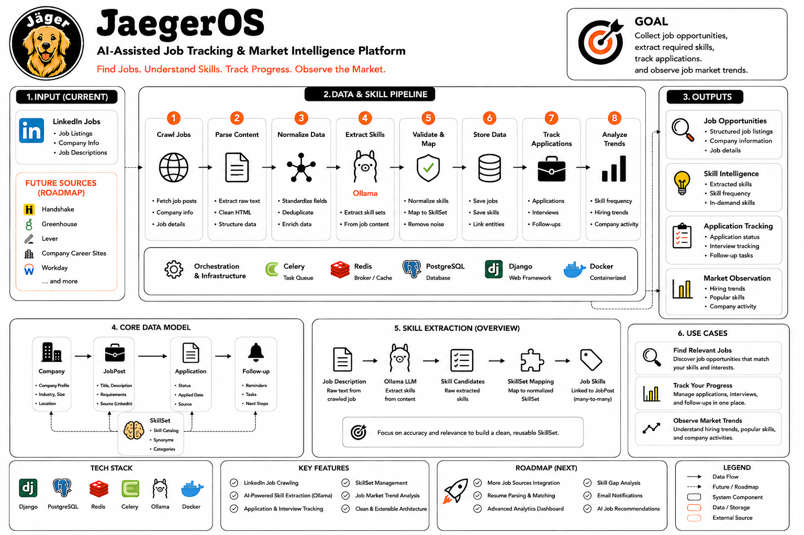
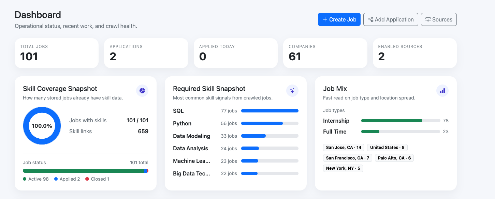
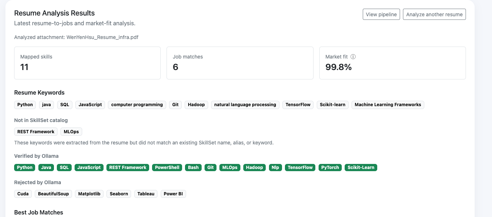
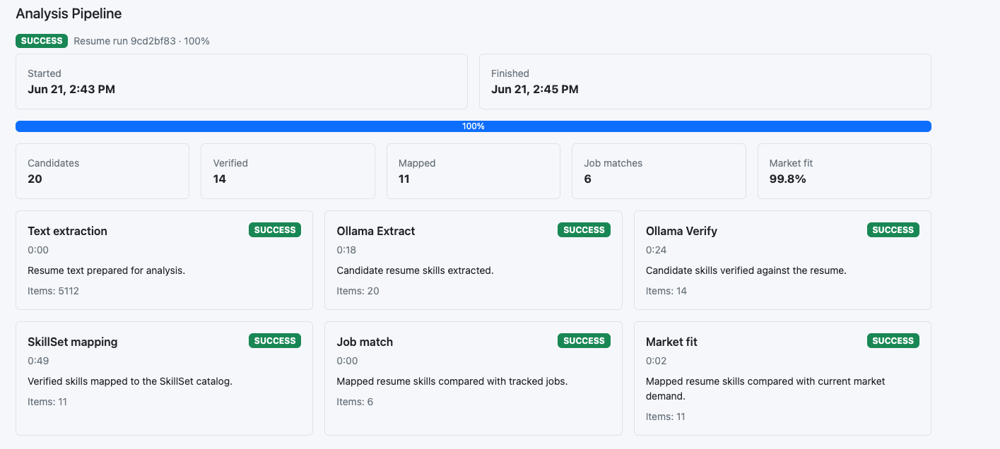
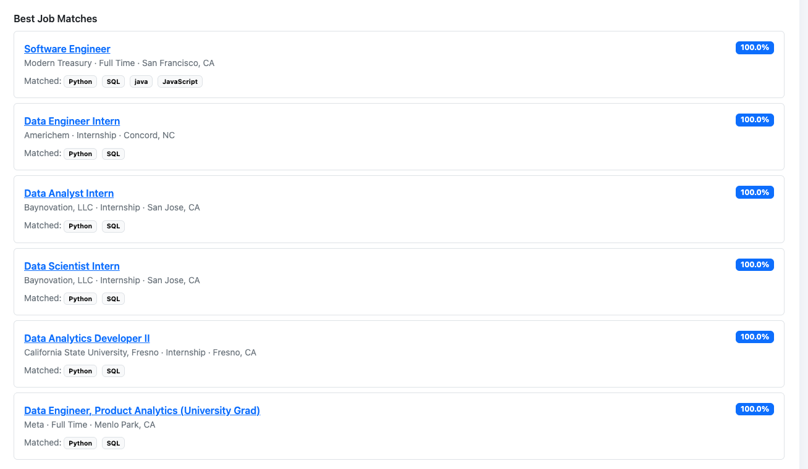
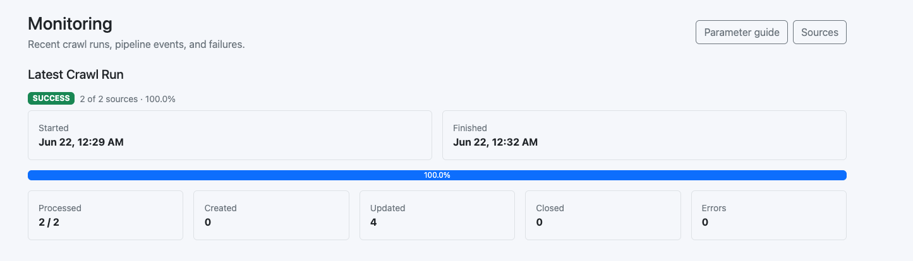
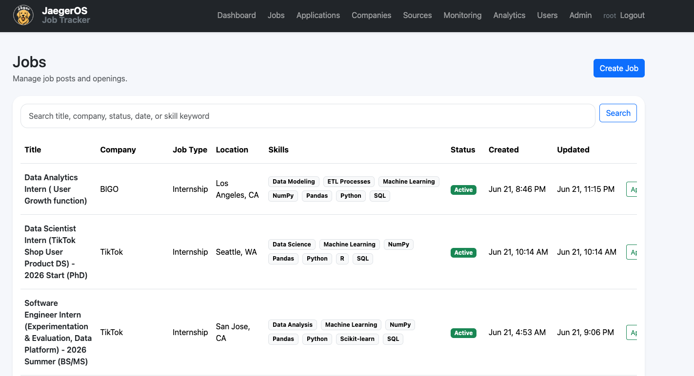

# JägerOS - Career Intelligence Platform


JägerOS is a Django-based career intelligence platform for job tracking, application management, automated crawling, Ollama skill extraction, market demand analysis, and resume matching.


---

## Architecture and Features



### Tech Stack

- Django 5, PostgreSQL 15, pgvector
- RAG, Prompt engineering, Context engineering
- Ollama (skill extraction, embeddings)
- Celery + Redis (background crawling)
- Docker Compose, Nginx

### Core Features

- Dashboard for Job Search Tracking
  - Provides market demand analysis, resume gap analysis, and job market fit evaluation using pgvector similarity search.
  - Visualizes career insights and application progress through an interactive dashboard.

- Resume Analysis Engine
  - Implements an Ollama-powered skill extraction pipeline: Extract → Verify → SkillSet Mapping → RAG (pgvector retrieval for unresolved skills).
  - Integrates the ESCO knowledge base and business/market taxonomies for skill normalization and career intelligence.
  - Resume RAG uses `SkillSet` pgvector embeddings; new skills from crawling are backfilled automatically (see [Celery Background Tasks](#celery-background-tasks)).


- Job Matching
  - Recommends relevant job opportunities based on skill alignment, experience, and market fit scoring.

- Job Source Crawler 
  - Currently supports LinkedIn, with a scalable architecture designed for multiple job sources.
  - Automated scheduled crawling powered by Celery Beat.

- Career Management Platform
  - Full CRUD support for Jobs, Companies, Applications, Interviews, and Reminders.
  - Centralized workflow for tracking the entire job application lifecycle.


### Project Structure

```text
jeageros-django-job-tracker/
├── data/esco/              # ESCO CSV files
├── docker-compose.yml
├── requirements/
│   ├── base.txt
│   └── dev.txt
└── src/
    ├── apps/
    │   ├── accounts/
    │   ├── analytics/
    │   ├── applications/
    │   ├── companies/
    │   ├── imports/        # Crawler, JobSource
    │   ├── jobs/
    │   ├── skills/         # SkillSet, ESCO, embeddings
    │   └── ...
    ├── config/
    └── manage.py
```

Development rules and architecture constraints: [AGENTS.md](AGENTS.md).  
Roadmap and progress: [PROGRESS.md](PROGRESS.md).


## Table of Instructions

1. [Prerequisites](#prerequisites)
2. [Installation from Scratch](#installation-from-scratch)
3. [Environment Variables](#environment-variables)
4. [Database Migration](#database-migration)
5. [Management Commands Reference](#management-commands-reference)
6. [Recommended First-Run Data Pipeline](#recommended-first-run-data-pipeline)
7. [Docker and Daily Development Commands](#docker-and-daily-development-commands)
8. [Built-in Django Commands](#built-in-django-commands)
9. [Ollama Setup](#ollama-setup)
10. [Celery Background Tasks](#celery-background-tasks)
11. [Post-Install Verification](#post-install-verification)
12. [Testing](#testing)

---

## Prerequisites

| Item | Version / Notes |
|------|-----------------|
| Git | Any recent version |
| Docker | 20.10+ |
| Docker Compose | v2 (`docker compose` subcommand) |
| Disk space | 5 GB+ recommended (PostgreSQL volume, ESCO CSV) |
| Ollama (optional) | Host install for skill extraction, embeddings, resume analysis; CRUD and crawling work without it, but AI features will fail |

Verify Docker is available:

```bash
docker info
docker compose version
```

---

## Installation from Scratch

The steps below assume you are in the **project root** (contains `docker-compose.yml` and `src/manage.py`).

### Step 1: Clone the repository

```bash
git clone git@github.com:wenyenhsu/jeageros-django-job-tracker.git
cd jeageros-django-job-tracker
```

### Step 2: Create the environment file

```bash
cp .env.example .env
```

Edit `.env` as needed (see [Environment Variables](#environment-variables)).

### Step 3: Verify ESCO data (skill knowledge base)

CSV files ship under `data/esco/`. Confirm they exist:

```bash
ls -la data/esco/
```

Expected files at minimum:

- `skills_en.csv`
- `skillGroups_en.csv`
- `broaderRelationsSkillPillar_en.csv`
- `skillSkillRelations_en.csv`

### Step 4: Build Docker images

```bash
docker compose build
```

### Step 5: Start all services

```bash
docker compose up -d
```

This starts:

| Service | Purpose | Exposed port |
|---------|---------|--------------|
| `web` | Django (runs `migrate` on startup) | `8000` |
| `db` | PostgreSQL 15 + pgvector | `5432` |
| `redis` | Celery broker | `6379` |
| `celery-worker` | Background tasks | — |
| `celery-beat` | Scheduler (crawl + skill embedding sync) | — |
| `nginx` | Reverse proxy | `80` |

Check container status:

```bash
docker compose ps
```

### Step 6: Confirm migrations are applied

The `web` container runs `python manage.py migrate` on startup, but verify manually:

```bash
docker compose exec web python manage.py showmigrations
```

If any migration shows `[ ]` (not applied), run:

```bash
docker compose exec web python manage.py migrate
```

### Step 7: Create an admin user

```bash
docker compose exec web python manage.py createsuperuser
```

Enter username, email, and password when prompted.

### Step 8: (Optional) Install Ollama on the host and pull models

Run on the **host machine** (not inside the container):

```bash
# Install Ollama: https://ollama.com
ollama pull qwen2.5-coder:7b
ollama pull mxbai-embed-large
```

Containers reach host Ollama at `http://host.docker.internal:11434` by default (see `extra_hosts` in `docker-compose.yml`).

### Step 9: Initialize skill and analytics data

Follow the [Recommended First-Run Data Pipeline](#recommended-first-run-data-pipeline).  
At minimum, run the ESCO import; run the rest based on which features you need.

### Step 10: Verify in the browser

| Page | URL |
|------|-----|
| Home | http://localhost:8000 |
| Django Admin | http://localhost:8000/admin |
| Nginx proxy | http://localhost |

Basic installation is complete.

---

## Environment Variables

`.env.example` and field descriptions:

```env
SECRET_KEY=change-me          # Django secret; change in production
DEBUG=1                         # 1 = development mode
ALLOWED_HOSTS=localhost,127.0.0.1

DB_NAME=jaegeros                # Must match POSTGRES_DB in docker-compose db service
DB_USER=postgres
DB_PASSWORD=postgres
DB_HOST=db                      # Service name in Docker; use localhost for local runs
DB_PORT=5432
```

Additional variables from `docker-compose.yml` (defaults apply when not set in `.env`):

| Variable | Default | Description |
|----------|---------|-------------|
| `DJANGO_SETTINGS_MODULE` | `config.settings.dev` | Django settings module |
| `OLLAMA_BASE_URL` | `http://host.docker.internal:11434` | Ollama API base URL |
| `OLLAMA_SKILL_MODEL` | `qwen2.5-coder:7b` | Skill extract / verify model |
| `OLLAMA_EMBEDDING_MODEL` | `mxbai-embed-large` | Embedding model |
| `CRAWL_SCHEDULE_SECONDS` | `900` | Celery Beat crawl interval (seconds) |
| `CRAWL_SKILL_PIPELINE_ENABLED` | `true` | Run skill pipeline after crawl |
| `SKILL_EMBEDDING_SCHEDULE_SECONDS` | `3600` | Celery Beat interval for `generate_skill_embeddings` (seconds) |
| `SKILL_EMBEDDING_BATCH_LIMIT` | `100` | Max SkillSets embedded per scheduled run |
| `SKILL_EMBEDDING_SYNC_ENABLED` | `true` | Enable automatic embedding sync (Beat + post-crawl) |
| `SKILL_EMBEDDING_SYNC_AFTER_CRAWL` | `true` | Queue embedding sync after a successful crawl |
| `USE_SQLITE` | `0` | Set `1` for SQLite (not recommended; no pgvector) |

---

## Database Migration

### Overview

- Migration files live in `src/apps/<app>/migrations/`.
- **Fresh database**: run `migrate` only; no `makemigrations` unless you change models.
- **After pulling new code**: run `showmigrations`, then `migrate`.

### Migrations by app

| App | Migrations |
|-----|------------|
| `companies` | `0001_initial` |
| `jobs` | `0001`–`0007` (includes Applied status) |
| `applications` | `0001`–`0003` |
| `interviews` | `0001_initial` |
| `reminders` | `0001_initial` |
| `imports` | `0001`–`0010` (JobSource, CrawlRun, etc.) |
| `skills` | `0001`–`0010` (ESCO, embeddings, Business/Market taxonomy) |
| `analytics` | `0001` (SkillDemand, SkillTrend) |

### First-time install

```bash
# 1. Check migration status per app ([X] = applied, [ ] = pending)
docker compose exec web python manage.py showmigrations

# 2. Apply all pending migrations
docker compose exec web python manage.py migrate

# 3. Confirm everything is [X]
docker compose exec web python manage.py showmigrations
```

### After changing models (developers)

```bash
# 1. Generate migration files from model changes
docker compose exec web python manage.py makemigrations

# 2. Limit to a single app (optional)
docker compose exec web python manage.py makemigrations skills

# 3. Apply migrations
docker compose exec web python manage.py migrate

# 4. Inspect SQL for a migration (debugging)
docker compose exec web python manage.py sqlmigrate skills 0010
```

### Other migration commands

```bash
# Migrate a single app only
docker compose exec web python manage.py migrate skills

# Roll back to a specific migration (dev only; use with care)
docker compose exec web python manage.py migrate skills 0009

# Squash migrations (advanced)
docker compose exec web python manage.py squashmigrations skills 0001 0010
```

### Common migration errors

| Error | Cause | Fix |
|-------|-------|-----|
| `relation "xxx" does not exist` | DB not migrated | `python manage.py migrate` |
| Migration conflict | Concurrent model changes | Merge migrations or reset dev DB volume |

Reset the development database (**deletes all data**):

```bash
docker compose down -v
docker compose up -d
docker compose exec web python manage.py migrate
docker compose exec web python manage.py createsuperuser
```

---

## Management Commands Reference

> **Docker command prefix**  
> Run from the project root:  
> `docker compose exec web python manage.py <command> [options]`  
>
> **Container working directory**: `/app/src` (where `manage.py` lives — **do not** `cd src`).  
> **Local (non-Docker)**: `cd src && python manage.py <command>`

The project defines **19 custom commands** (including 1 alias).

---

### imports — Job crawling

#### `crawl_job_sources`

Runs the JobSource crawl and sync pipeline (company upsert, job upsert, skill pipeline).

```bash
# Crawl all enabled JobSources
docker compose exec web python manage.py crawl_job_sources

# Crawl a single JobSource by id
docker compose exec web python manage.py crawl_job_sources --source-id 1
```

| Option | Description |
|--------|-------------|
| `--source-id <int>` | Process only this `JobSource.id` |

Output includes summaries for `Created`, `Updated`, `Closed`, `Filtered`, `Skills attached`, `Errors`, etc.

**When to run**: After creating JobSources in Admin, or to trigger a crawl outside Celery Beat.

---

#### `crawl_jobs`

**Alias** for `crawl_job_sources` — identical behavior.

```bash
docker compose exec web python manage.py crawl_jobs
docker compose exec web python manage.py crawl_jobs --source-id 1
```

---

### skills — ESCO and skill knowledge base

#### `inspect_esco_data`

Inspects ESCO CSV files (paths, row counts). **Does not write to the database.**

```bash
docker compose exec web python manage.py inspect_esco_data

# Custom data directory
docker compose exec web python manage.py inspect_esco_data --data-dir /app/data/esco
```

| Option | Description |
|--------|-------------|
| `--data-dir <path>` | ESCO CSV directory (default: `data/esco`) |

**When to run**: Before `import_esco`, to confirm CSVs are ready.

---

#### `import_esco`

**One-shot full ESCO import** (skills, aliases, taxonomy, relationships) with validation stats at the end.

```bash
# Import from local CSV (default)
docker compose exec web python manage.py import_esco

# Custom directory
docker compose exec web python manage.py import_esco --data-dir /app/data/esco

# Import from public ESCO API (requires network)
docker compose exec web python manage.py import_esco --source api --language en

# Skip skill-skill relationships (faster)
docker compose exec web python manage.py import_esco --skip-relationships

# Skip SkillKeyword sync
docker compose exec web python manage.py import_esco --skip-keyword-sync
```

| Option | Description |
|--------|-------------|
| `--data-dir <path>` | CSV directory |
| `--source csv\|api` | Data source (default: `csv`) |
| `--language <code>` | API language (default: `en`) |
| `--skip-relationships` | Skip skill relationship import |
| `--skip-keyword-sync` | Skip SkillKeyword sync |

**When to run**: First install, or when rebuilding the skill knowledge base.

---

#### `import_esco_skills`

Imports ESCO skills only → `SkillSet`.

```bash
docker compose exec web python manage.py import_esco_skills
docker compose exec web python manage.py import_esco_skills --data-dir /app/data/esco
```

| Option | Description |
|--------|-------------|
| `--data-dir <path>` | CSV directory |

---

#### `import_esco_aliases`

Imports ESCO alternative labels only → `SkillAlias`.

```bash
docker compose exec web python manage.py import_esco_aliases
docker compose exec web python manage.py import_esco_aliases --data-dir /app/data/esco
```

---

#### `import_esco_taxonomy`

Imports ESCO skill groups only → `SkillCategory`.

```bash
docker compose exec web python manage.py import_esco_taxonomy
docker compose exec web python manage.py import_esco_taxonomy --data-dir /app/data/esco
```

---

#### `import_esco_relationships`

Imports ESCO skill-skill relationships only → `SkillRelationship`.

```bash
docker compose exec web python manage.py import_esco_relationships
docker compose exec web python manage.py import_esco_relationships --data-dir /app/data/esco
```

---

#### `validate_skill_knowledge_base`

Post-import quality check: counts, missing categories, orphan skills, duplicate aliases.

```bash
docker compose exec web python manage.py validate_skill_knowledge_base
```

**When to run**: After `import_esco`.

---

#### `seed_us_emerging_skills`

Seeds curated US emerging technology skills into `SkillSet` (aliases and category links included).

```bash
docker compose exec web python manage.py seed_us_emerging_skills
```

No additional options.

---

#### `seed_business_taxonomy`

Creates JägerOS **Business Category** taxonomy and assigns skill mappings.

```bash
# Create categories and assign
docker compose exec web python manage.py seed_business_taxonomy

# Re-assign only (categories already exist)
docker compose exec web python manage.py seed_business_taxonomy --assign-only
```

| Option | Description |
|--------|-------------|
| `--assign-only` | Skip category creation; run assignment only |

**Prerequisites**: `skills.0010` migration applied and ESCO import completed.

---

#### `seed_market_taxonomy`

Creates **US Market Category** taxonomy and assigns skill mappings.

```bash
docker compose exec web python manage.py seed_market_taxonomy
docker compose exec web python manage.py seed_market_taxonomy --assign-only
```

| Option | Description |
|--------|-------------|
| `--assign-only` | Skip category creation; run assignment only |

---

#### `validate_skill_normalization`

Checks skill normalization coverage: unresolved aliases, duplicate canonicals, orphan relationships.

```bash
docker compose exec web python manage.py validate_skill_normalization
```

**When to run**: After taxonomy seeding, or when skill mapping looks wrong.

---

#### `generate_skill_embeddings`

Generates pgvector embeddings for `SkillSet` records (default: Ollama `mxbai-embed-large`).  
Embeddings power **resume RAG** (`SkillRAGPipeline` vector retrieval) and **Market Fit** cosine similarity.

**Automatic sync** (no manual command required when Celery is running):

- **Celery Beat** task `generate-skill-embeddings` — processes skills missing embeddings every `SKILL_EMBEDDING_SCHEDULE_SECONDS` (default: 1 hour), up to `SKILL_EMBEDDING_BATCH_LIMIT` per run.
- **After crawl** — a successful `crawl_all_sources` run queues the same sync (when `SKILL_EMBEDDING_SYNC_AFTER_CRAWL=true`).

Job crawl may `auto_create` new `SkillSet` rows without embeddings; scheduled sync backfills them so resume analysis RAG does not rely only on alias/exact/catalog text matching.

```bash
# Process skills without embeddings only
docker compose exec web python manage.py generate_skill_embeddings

# Force regenerate all
docker compose exec web python manage.py generate_skill_embeddings --force

# Limit count (testing or one-off batch)
docker compose exec web python manage.py generate_skill_embeddings --limit 100
```

| Option | Description |
|--------|-------------|
| `--force` | Overwrite existing embeddings |
| `--limit <int>` | Maximum records to process (overrides default batch limit for this run) |

**Prerequisites**: Ollama running with the embedding model pulled; `skills.0008` migration (pgvector column); `celery-beat` + `celery-worker` for scheduled sync.

**Trigger via Celery** (optional):

```bash
docker compose exec celery-worker celery -A config call apps.skills.tasks.generate_skill_embeddings
```

---

### analytics — Market demand and resume evaluation

#### `update_skill_demand`

Aggregates `JobPostSkill` data into `SkillDemand` and `SkillTrend`.

```bash
docker compose exec web python manage.py update_skill_demand
```

**When to run**: After crawling and attaching skills to jobs; required for dashboard market analytics.

---

#### `eval_resume_ollama`

Runs repeated Ollama resume analysis against a gold JSON spec (development / tuning).

```bash
docker compose exec web python manage.py eval_resume_ollama \
  /path/to/resume.pdf \
  /path/to/gold.json

# Custom run count
docker compose exec web python manage.py eval_resume_ollama \
  resume.pdf gold.json --runs 5

# Write full JSON report
docker compose exec web python manage.py eval_resume_ollama \
  resume.pdf gold.json --output /tmp/report.json

# Non-zero exit if any run fails expectations
docker compose exec web python manage.py eval_resume_ollama \
  resume.pdf gold.json --fail-on-regression

# Limit job / market comparison counts
docker compose exec web python manage.py eval_resume_ollama \
  resume.pdf gold.json --job-limit 20 --market-limit 50
```

| Argument / Option | Description |
|-------------------|-------------|
| `resume_path` | Resume file path (PDF, DOCX, TXT, Markdown) |
| `gold_path` | Expected skills JSON spec |
| `--runs <int>` | Number of runs (default: 3) |
| `--output <path>` | Write full report to file |
| `--fail-on-regression` | Exit with error on failure |
| `--job-limit <int>` | Limit job comparisons |
| `--market-limit <int>` | Limit market comparisons |

---

## Recommended First-Run Data Pipeline

For a **full-featured** fresh install (skill KB + vectors + market analytics + crawling), run in order:

```bash
# 0. Confirm migrations and admin (see install steps above)
docker compose exec web python manage.py migrate
docker compose exec web python manage.py createsuperuser

# 1. Check ESCO CSVs
docker compose exec web python manage.py inspect_esco_data

# 2. Import ESCO knowledge base (can take a while)
docker compose exec web python manage.py import_esco

# 3. Validate ESCO import
docker compose exec web python manage.py validate_skill_knowledge_base

# 4. Seed US emerging skills
docker compose exec web python manage.py seed_us_emerging_skills

# 5. Business / Market taxonomy layers
docker compose exec web python manage.py seed_business_taxonomy
docker compose exec web python manage.py seed_market_taxonomy

# 6. Normalization check
docker compose exec web python manage.py validate_skill_normalization

# 7. Generate embeddings (requires Ollama; also runs automatically via Celery Beat)
docker compose exec web python manage.py generate_skill_embeddings

# 8. Create JobSources in Admin, then crawl
#    (crawl may auto_create new SkillSets; post-crawl embedding sync runs if enabled)
docker compose exec web python manage.py crawl_job_sources

# 9. Refresh market demand aggregates
docker compose exec web python manage.py update_skill_demand
```

For **basic CRUD only** (no AI / analytics), step 0 plus `createsuperuser` is enough to log in.

---

## Docker and Daily Development Commands

```bash
# Start (detached)
docker compose up -d

# Start and stream logs (foreground)
docker compose up

# Stop
docker compose down

# Stop and remove DB volume (wipes database)
docker compose down -v

# Rebuild images and start
docker compose build --no-cache
docker compose up -d

# Service status
docker compose ps

# Web logs
docker compose logs -f web

# Shell into web container (WORKDIR is already /app/src)
docker compose exec web bash

# PostgreSQL shell
docker compose exec db psql -U postgres -d jaegeros
```

---

## Built-in Django Commands

All use the `docker compose exec web python manage.py` prefix.

| Command | Purpose |
|---------|---------|
| `check` | Validate Django settings and common issues |
| `shell` | Django ORM shell |
| `dbshell` | Database CLI |
| `createsuperuser` | Create admin user |
| `changepassword <username>` | Reset password |
| `flush` | Clear all tables (dev only; requires confirmation) |
| `dumpdata <app>` | Export JSON data |
| `loaddata <fixture>` | Load fixture |
| `collectstatic` | Collect static files (production deploy) |
| `test` | Django test runner |
| `showmigrations` | Show migration status |
| `makemigrations` | Generate migrations |
| `migrate` | Apply migrations |
| `sqlmigrate <app> <num>` | Show migration SQL |
| `clearsessions` | Remove expired sessions |

Examples:

```bash
docker compose exec web python manage.py check
docker compose exec web python manage.py shell
docker compose exec web python manage.py collectstatic --noinput
```

---

## Ollama Setup

1. Install and start Ollama on the host.
2. Pull models:

```bash
ollama pull qwen2.5-coder:7b
ollama pull mxbai-embed-large
```

3. Verify the API on the host:

```bash
curl http://localhost:11434/api/tags
```

4. Default URL inside Docker: `OLLAMA_BASE_URL=http://host.docker.internal:11434`  
   On Linux, if `host.docker.internal` fails, set the host IP in `.env`.

Features that depend on Ollama:

- Post-crawl skill Extract / Verify / Mapping
- `generate_skill_embeddings` (scheduled + post-crawl, and manual command)
- Resume analysis RAG vector retrieval and `eval_resume_ollama`

---

## Celery Background Tasks

```bash
# Worker logs
docker compose logs -f celery-worker

# Beat scheduler logs
docker compose logs -f celery-beat
```

### Scheduled tasks (Celery Beat)

| Beat key | Task | Default interval | Purpose |
|----------|------|------------------|---------|
| `crawl-enabled-job-sources` | `apps.imports.tasks.crawl_all_sources` | `CRAWL_SCHEDULE_SECONDS` (900 s) | Crawl enabled JobSources, sync jobs, run skill pipeline |
| `generate-skill-embeddings` | `apps.skills.tasks.generate_skill_embeddings` | `SKILL_EMBEDDING_SCHEDULE_SECONDS` (3600 s) | Backfill `SkillSet.embedding` for RAG / Market Fit |

After a **successful** crawl, the worker also queues an embedding sync batch (when `SKILL_EMBEDDING_SYNC_AFTER_CRAWL=true`), so new skills from crawling enter the pgvector index without waiting for the next Beat tick.

To trigger a crawl manually:

```bash
docker compose exec web python manage.py crawl_job_sources
```

To tune embedding coverage for resume RAG (example: every 15 minutes, 200 skills per batch):

```env
SKILL_EMBEDDING_SCHEDULE_SECONDS=900
SKILL_EMBEDDING_BATCH_LIMIT=200
```

---

## Post-Install Verification

### 1. HTTP and Admin

- http://localhost:8000 loads
- http://localhost:8000/admin accepts superuser login

### 2. pgvector extension

```bash
docker compose exec db psql -U postgres -d jaegeros -c "SELECT * FROM pg_extension WHERE extname = 'vector';"
```

You should see one row for `vector`.

### 3. All migrations applied

```bash
docker compose exec web python manage.py showmigrations
```

Every entry should show `[X]`.

### 4. Skill and embedding counts

```bash
docker compose exec web python manage.py shell
```

```python
from apps.skills.models import SkillSet

total = SkillSet.objects.count()
embedded = SkillSet.objects.filter(embedding__isnull=False).count()
print(f"Total Skills: {total}")
print(f"Embedded Skills: {embedded}")
```

After ESCO import, `total` should be > 0. After `generate_skill_embeddings` (manual or Celery), `embedded` should increase.  
If crawl creates many new skills, run Beat/worker and wait for batches to complete, or run `generate_skill_embeddings --limit N` manually.

### 5. Market demand data

```bash
docker compose exec web python manage.py shell
```

```python
from apps.analytics.models import SkillDemand
print(SkillDemand.objects.count())
```

Meaningful counts require crawling plus `update_skill_demand`.

---

## Testing

The project uses pytest (see `pytest.ini` at the repo root).

```bash
# Inside the web container
docker compose exec web pytest

# Single file
docker compose exec web pytest apps/analytics/tests/test_market_fit_service.py -v

# On the host (install dev dependencies first)
cd src
pip install -r ../requirements/dev.txt
pytest
```

---

## License

MIT License

---
